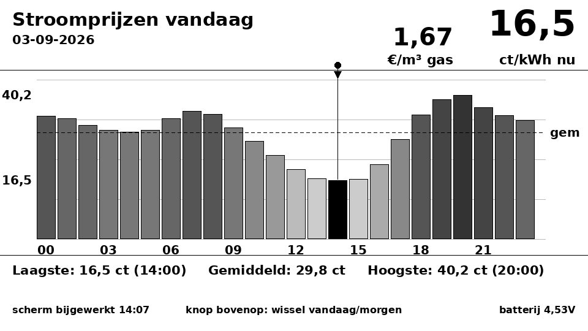
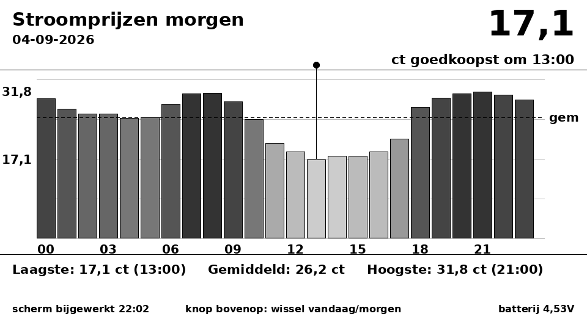
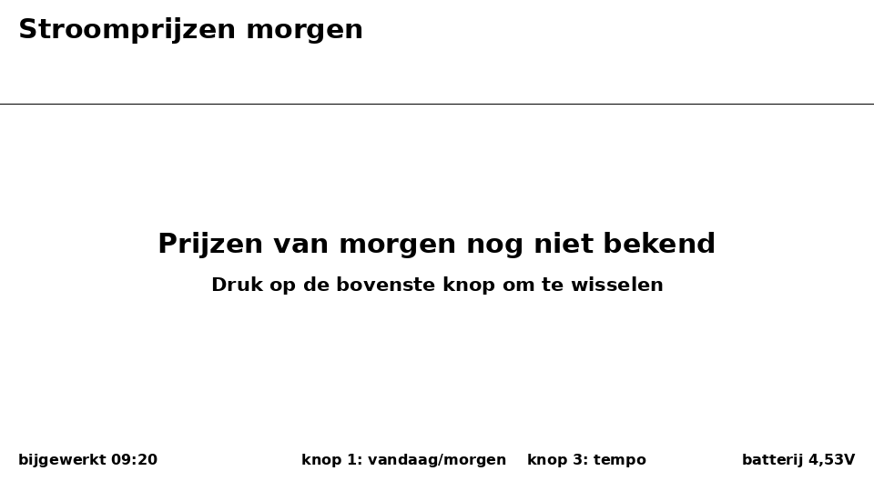

# LilyGo T5 4.7" stroomprijzen-dashboard

Een e-paper dashboard dat de Nederlandse dynamische stroomprijzen toont op een
LilyGo T5 4.7" — de **all-in prijs die je leverancier ook factureert**, niet de
kale spotprijs. Draait op ESPHome, haalt zijn data uit Home Assistant
(Zonneplan), en werkt op accu: het apparaat slaapt en wordt twee keer per dag
wakker om het scherm bij te werken. De gasprijs van de dag staat er ook bij.



Boven de balk van het huidige uur staat een pijltje; het rondje markeert het
goedkoopste uur. Donkerder grijs = duurder. Links van de huidige prijs staat de
gasdagprijs. Bij de "morgen"-weergave vervalt de huidige prijs rechtsboven en
komt daar het goedkoopste moment van morgen te staan (de gasprijs vervalt daar,
want voor morgen is er nog geen gasdagprijs):



Zijn de prijzen van morgen nog niet gepubliceerd, dan zegt het scherm dat
gewoon in plaats van verouderde cijfers te tonen:



## Waarom deze repo bestaat

De bestaande community-component voor dit scherm (`vbaksa/esphome`) compileert
niet meer op een moderne ESPHome, en als je hem aan de praat krijgt tekent hij
een leeg scherm. In deze repo zit een gepatchte versie plus een uitgebreide
beschrijving van elk probleem en waarom de fix werkt:

**→ [docs/troubleshooting.md](docs/troubleshooting.md)**

Dat bestand is waarschijnlijk nuttiger dan de dashboardcode zelf als je dit
scherm voor iets anders wilt gebruiken.

Getest op ESPHome 2026.8.1 / ESP-IDF 5.5.5, ESP32-WROVER-E rev 3.0,
8 MB PSRAM, ED047TC1-paneel (960x540).

## Hoe het werkt

```
Zonneplan (HACS-integratie fsaris/home-assistant-zonneplan-one)
        │
        ├─ sensor.zonneplan_current_quarter_hourly_electricity_tariff
        │       attribuut forecast: kwartierprijzen, ~1 dag terug .. 2 vooruit
        │       ▼  twee trigger-based template sensors filteren op de dag
        │  sensor.stroomprijzen_vandaag_csv   sensor.stroomprijzen_morgen_csv
        │       "0.345,0.337,0.319,..."  (EUR/kWh) + attribuut datum
        │
        └─ sensor.zonneplan_current_tariff_gas   (EUR/m3, dagprijs)
                ▼  (ESPHome native API)
        LilyGo T5 4.7"  ← heeft beide dagen, knop 1 wisselt ertussen
```

**Twee sensoren, elk met een vaste betekenis.** Dat is nodig omdat het scherm
beide datasets tegelijk moet hebben om te kunnen wisselen. (Eerder was het één
sensor die om 22:00 omklapte van vandaag naar morgen.)

**Waarom niet zelf omrekenen vanaf de spotprijs?** Dat kan technisch prima
(spot + inkoopvergoeding + energiebelasting + btw), maar het is een formule die
stilzwijgend gaat driften: de opslag is een contractvoorwaarde en de
energiebelasting wijzigt elk jaar per 1 januari. Je merkt dan niet dat je
scherm fout staat. Daarom nemen we de prijs af van de partij die hem ook
factureert: `price_tax_included` uit het forecast-attribuut is de all-in
consumentenprijs.

Drie details die makkelijk misgaan:

* **`amount` staat in 1e-7 EUR.** `2536993` is `0,2536993` EUR/kWh. Delen door
  10000000 dus.
* **Zonneplan levert kwartierprijzen** (96 per dag). Die passen als losse
  waarden niet binnen de HA state-limiet van 255 tekens; de state werd
  stilzwijgend `unknown`. De sensor middelt ze daarom per **lokaal** uur
  (via `as_datetime | as_local`, niet UTC) terug naar 24 waarden.
* **Op DST-dagen** klopt het niet exact: de sensor loopt `range(24)` af, dus op
  de 25-uursdag worden de twee uren "2" samengevoegd en op de 23-uursdag
  ontbreekt uur 2. Cosmetisch, twee dagen per jaar.

## Ververs-schema

Bewust niet elk uur - dat kost accu zonder iets toe te voegen.

| Wanneer | Beide sensoren |
|---|---|
| HA-opstart | ✓ |
| 00:05 | ✓ |
| elk half uur (`minutes: "/30"`) | ✓ |
| event `stroomprijzen_refresh` | ✓ (handmatig, handig na een template-reload) |

Het forecast-venster van Zonneplan loopt ~32 uur vooruit, dus vandaag én morgen
zitten er altijd in — er is geen apart "ophaalmoment" meer nodig zoals bij een
day-ahead-fetch. Het half-uurritme is er vooral voor zelfherstel: staat de
integratie bij HA-opstart nog niet klaar, dan is de sensor binnen 30 minuten
alsnog gevuld.

Het apparaat wordt om **00:07** en **22:02** wakker. Bij die geplande wakes kiest het scherm zelf de
logische weergave: 's nachts vandaag, vanaf 22:00 morgen. Zo zie je 's avonds
of je de vaatwasser 's nachts moet laten draaien of beter tot morgenmiddag
kunt wachten.

## Bediening

**Elke knopdruk wisselt tussen vandaag en morgen** - zowel de wake-knop
(IO39) als de resetknop (RST). Indrukken wekt het apparaat, het wisselt van
dag en tekent opnieuw. Nog eens indrukken brengt je terug.

Dat het ook op RST werkt is bewust: op de T5 4.7" staan de knoppen in de
volgorde **IO39 - IO34 - IO35 - IO0 - RST**, en RST is voor de meeste mensen
de knop die het makkelijkst te vinden is. Deep sleep verlaten via een reset
kost net zoveel als via de wake-pin, dus er is geen reden om je naar een
specifieke knop te dwingen.

Alleen een **geplande wake** (00:07 / 22:02) kiest zelf: 's nachts vandaag,
's avonds morgen. De firmware onderscheidt dat aan de wake-oorzaak - is die
`ESP_SLEEP_WAKEUP_TIMER`, dan is het de klok; al het andere is een mens.

> Ook een herstart na een OTA-update telt als knopdruk, dus vlak na het
> flashen kan het scherm op "morgen" springen. Eén druk zet het terug.

Zijn de prijzen van morgen nog niet gepubliceerd, dan toont het scherm
"Prijzen van morgen nog niet bekend" in plaats van verouderde cijfers. De
firmware vergelijkt daarvoor het `datum`-attribuut van de sensor met zijn eigen
berekende datum van morgen; komen die niet overeen, dan is de sensor blijven
hangen op een mislukte fetch.

De middelste knop (GPIO34) houdt het apparaat wakker voor onderhoud/OTA.

De **gasprijs** staat links van het grote getal, alleen in de vandaag-weergave.
Zonneplan publiceert geen gasdagprijs voor morgen (de gasdag loopt van 06:00 tot
06:00), dus in de morgen-weergave zou daar stilzwijgend de prijs van vandaag
staan. Liever niets dan een getal dat het verkeerde zegt.

## Installatie

### 1. Home Assistant

1. Installeer via HACS de integratie
   [fsaris/home-assistant-zonneplan-one](https://github.com/fsaris/home-assistant-zonneplan-one)
   en log in met je Zonneplan-account. Controleer dat
   `sensor.zonneplan_current_quarter_hourly_electricity_tariff` bestaat en een
   `forecast`-attribuut heeft. Heet die entiteit bij jou anders (bijvoorbeeld
   de uur- in plaats van de kwartiervariant), pas dan de naam bovenin
   `stroomprijzen_sensor.yaml` aan.
2. Kopieer `homeassistant/stroomprijzen_sensor.yaml` naar je config-map.
3. Voeg aan `configuration.yaml` toe:
   ```yaml
   template: !include stroomprijzen_sensor.yaml
   ```
   > Heb je al een `template:`-blok? Voeg dan **niet** een tweede toe. YAML
   > overschrijft de ene sleutel stilzwijgend met de andere: geen foutmelding,
   > "Controleer configuratie" blijft groen, maar je sensor verschijnt nooit.
   > Zet alles onder één `template:`-sleutel.
4. Herstart HA en controleer dat `sensor.stroomprijzen_vandaag_csv` een rij
   getallen bevat. Blijft hij leeg, vuur dan het event
   `stroomprijzen_refresh` af via Ontwikkelhulpmiddelen > Gebeurtenissen.

### 2. ESPHome

1. Kopieer `esphome/t5-stroomprijzen.yaml` en de map
   `esphome/components/` naar je ESPHome-configmap.
2. Kopieer `esphome/secrets.yaml.example` naar `secrets.yaml` en vul je
   wifi- en OTA-gegevens in.
3. Pas bovenin `esp_name` / `esp_hostname` aan naar smaak.
4. Compileer en flash. **De eerste keer via USB**, daarna kan het via OTA.

De map `components/` moet naast je device-YAML staan; `external_components`
verwijst er relatief naar.

## Hardware

Originele LilyGo T5 4.7" (ESP32-WROVER-E, ED047TC1 960x540, met PSRAM). **Niet**
de nieuwere ESP32-S3 "Plus"-versie; die heeft een ander bord en een andere
epdiy-boarddefinitie.

| GPIO | Functie |
|---|---|
| 39 | Wake uit deep sleep + **wisselen tussen vandaag en morgen** (bovenste zijknop) |
| 34 | Stay-awake: houdt het apparaat wakker voor onderhoud/OTA |
| 35 | Vrij |
| 36 | Accuspanning (ADC, deler x2) |

Knop 1 moest de wisselknop worden omdat hij als enige het apparaat kan wekken:
de ESP32 ext1-wakeup staat op `ALL_LOW`, en dat betekent letterlijk "wek als
*alle* opgegeven pinnen laag zijn". Een tweede pin toevoegen zou betekenen dat
je twee knoppen tegelijk moet indrukken.

## Layout aanpassen zonder te flashen

`tools/render_preview.py` simuleert de tekenlogica uit de ESPHome-lambda in
Python/PIL en **kwantiseert naar dezelfde 16 grijswaarden die het paneel echt
aankan**. De preview is dus representatief. Draai dit vóór het flashen als je
iets aan de layout verandert; dat scheelt een hele build-en-flash-cyclus.

```bash
pip install pillow
python3 tools/render_preview.py
```

Pas je de lambda aan, pas dan ook dit script aan (of andersom) - ze worden
niet automatisch gesynchroniseerd.

## Bekende valkuilen

Kort samengevat; de volledige uitleg staat in
[docs/troubleshooting.md](docs/troubleshooting.md).

* **`psram:` is verplicht.** Zonder dat blok crasht de firmware direct in een
  boot loop (`assert failed: epd_hl_init ... state.back_fb != NULL`). De
  Arduino-vlag `-DBOARD_HAS_PSRAM` is onder ESP-IDF niet genoeg.
* **epdiy gebruikt 255 = wit, 0 = zwart.** De upstream-component draaide dat
  om, waardoor zwarte tekst als wit werd weggeschreven: onzichtbaar, én zonder
  verschil met het vorige beeld, dus er werd helemaal niets naar het paneel
  gestuurd.
* **`epd_driver.h` bestaat niet meer**, dat is nu `epdiy.h`. En `epd_init()`
  heeft drie argumenten gekregen.
* **`ED047TC1`, niet `ED097TC2`** - dat laatste is het 9,7"-paneel, ook al
  gebruikt het lilygo-voorbeeld in de epdiy-repo het.
* **Prijzen zijn all-in, niet spot.** Reken ze niet zelf uit vanaf Nord Pool:
  de opslag is een contractvoorwaarde en de energiebelasting wijzigt jaarlijks.
* **Dunne fonts ogen grijs op e-paper.** Niet de kleur of de grootte is het
  probleem maar het gewicht; alle fonts staan daarom op `@700`.
* **`deep_sleep.enter` negeert `deep_sleep.prevent`.** Wil je het apparaat
  wakker houden, gebruik dan een global + `wait_until`, zoals hier gedaan.
* **ext1-wakeup met `ALL_LOW` en meerdere pinnen** wekt pas als *alle* pinnen
  tegelijk laag zijn - niet bij de eerste de beste knop.

## Herkomst en licentie

Deze repo bevat afgeleid werk:

* `esphome/components/lilygo_t5_47_display/` is gebaseerd op het
  `lilygo_t5_47_display`-component uit
  [vbaksa/esphome](https://github.com/vbaksa/esphome), een fork van
  [ESPHome](https://github.com/esphome/esphome). De C++-code van ESPHome staat
  onder **GPL-3.0**.
* De component linkt tegen [epdiy](https://github.com/vroland/epdiy)
  (**LGPL-3.0**), dat als PlatformIO-library tijdens de build wordt
  opgehaald - er staat geen epdiy-broncode in deze repo.

Er is bewust nog **geen LICENSE-bestand** toegevoegd: dat is een keuze van de
eigenaar van deze repo. Houd er wel rekening mee dat de afgeleide component een
GPL-3.0-compatibele licentie vereist.
